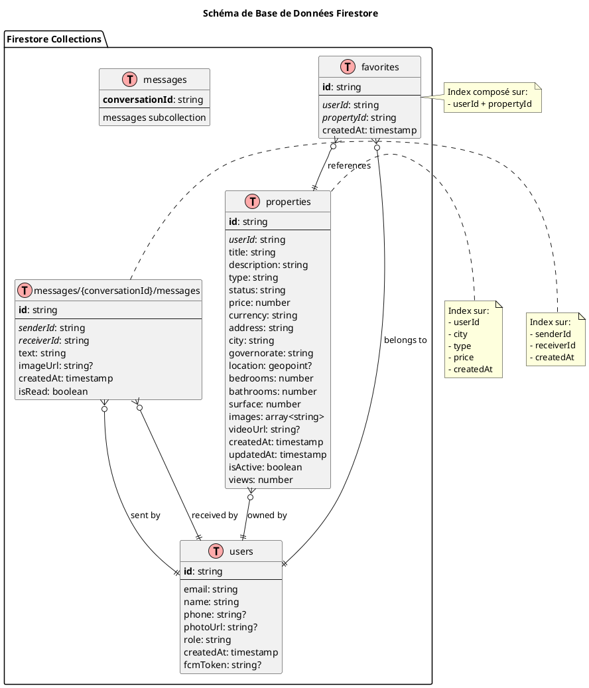

# Architecture C4 - Application Immobilier (PlantUML)

## Guide d'utilisation

Ce fichier contient les diagrammes C4 en syntaxe PlantUML. Pour générer les diagrammes :

1. **En ligne** : Copiez le code et collez-le sur [PlantUML Online Server](http://www.plantuml.com/plantuml/uml/)
2. **VS Code** : Installez l'extension "PlantUML" et prévisualisez avec `Alt+D`
3. **CLI** : Utilisez `plantuml diagram.puml` pour générer des images

---

## Niveau 1 : Diagramme de Contexte (Context)

```plantuml
@startuml C1_Context
!include https://raw.githubusercontent.com/plantuml-stdlib/C4-PlantUML/master/C4_Context.puml

LAYOUT_WITH_LEGEND()

title Diagramme de Contexte - Système Immobilier

Person(user, "Utilisateur Final", "Cherche et consulte des propriétés immobilières")
Person(owner, "Propriétaire/Vendeur", "Publie et gère ses annonces immobilières")

System(immobilierApp, "Application Immobilier", "Application mobile/web Flutter pour la gestion de biens immobiliers avec messagerie intégrée")

System_Ext(firebaseAuth, "Firebase Authentication", "Service d'authentification Google")
System_Ext(firestore, "Cloud Firestore", "Base de données NoSQL en temps réel")
System_Ext(firebaseStorage, "Firebase Storage", "Stockage cloud pour images et médias")
System_Ext(fcm, "Firebase Cloud Messaging", "Service de notifications push")

Rel(user, immobilierApp, "Recherche et consulte des propriétés", "HTTPS")
Rel(owner, immobilierApp, "Publie et gère des annonces", "HTTPS")

Rel(immobilierApp, firebaseAuth, "Authentifie les utilisateurs", "Firebase SDK")
Rel(immobilierApp, firestore, "Lit/Écrit les données", "Firebase SDK")
Rel(immobilierApp, firebaseStorage, "Upload/Download images", "Firebase SDK")
Rel(immobilierApp, fcm, "Envoie/Reçoit notifications", "Firebase SDK")

@enduml
```

---

## Niveau 2 : Diagramme des Conteneurs (Containers)

```plantuml
@startuml C2_Containers
!include https://raw.githubusercontent.com/plantuml-stdlib/C4-PlantUML/master/C4_Container.puml

LAYOUT_WITH_LEGEND()

title Diagramme des Conteneurs - Application Immobilier

Person(user, "Utilisateur", "Utilisateur de l'application")

System_Boundary(immobilierSystem, "Application Immobilier") {
    Container(mobileApp, "Application Mobile", "Flutter/Dart", "Interface utilisateur native pour iOS et Android")
    Container(webApp, "Application Web", "Flutter/Dart", "Interface utilisateur web pour navigateurs")
    Container(desktopApp, "Application Desktop", "Flutter/Dart", "Interface utilisateur pour Windows/macOS/Linux")
}

System_Boundary(firebaseBackend, "Firebase Backend") {
    ContainerDb(firestore, "Firestore Database", "NoSQL Database", "Stocke les propriétés, utilisateurs, messages")
    Container(storage, "Cloud Storage", "Object Storage", "Stocke les images et vidéos")
    Container(auth, "Authentication", "Firebase Auth", "Gère l'authentification des utilisateurs")
    Container(fcm, "Cloud Messaging", "FCM", "Envoie les notifications push")
    Container(functions, "Cloud Functions", "Node.js", "Logique métier côté serveur")
}

Rel(user, mobileApp, "Utilise", "HTTPS")
Rel(user, webApp, "Utilise", "HTTPS")
Rel(user, desktopApp, "Utilise", "HTTPS")

Rel(mobileApp, auth, "Authentifie via", "Firebase SDK")
Rel(mobileApp, firestore, "Lit/Écrit", "Firebase SDK")
Rel(mobileApp, storage, "Upload/Download", "Firebase SDK")
Rel(mobileApp, fcm, "Reçoit notifications", "Firebase SDK")

Rel(webApp, auth, "Authentifie via", "Firebase SDK")
Rel(webApp, firestore, "Lit/Écrit", "Firebase SDK")
Rel(webApp, storage, "Upload/Download", "Firebase SDK")

Rel(desktopApp, auth, "Authentifie via", "Firebase SDK")
Rel(desktopApp, firestore, "Lit/Écrit", "Firebase SDK")
Rel(desktopApp, storage, "Upload/Download", "Firebase SDK")

Rel(functions, firestore, "Déclenché par", "Firestore Triggers")
Rel(functions, fcm, "Envoie via", "Admin SDK")

@enduml
```

---

## Niveau 3 : Diagramme des Composants (Components)

```plantuml
@startuml C3_Components
!include https://raw.githubusercontent.com/plantuml-stdlib/C4-PlantUML/master/C4_Component.puml

LAYOUT_WITH_LEGEND()

title Diagramme des Composants - Application Flutter

Container(mobileApp, "Application Mobile Flutter", "Flutter/Dart", "Application client")

Container_Boundary(app, "Application Flutter") {
    
    Component(splashScreen, "Splash Screen", "Screen", "Écran de démarrage")
    Component(onboardingScreen, "Onboarding Screen", "Screen", "Écran d'introduction")
    Component(loginScreen, "Login Screen", "Screen", "Écran de connexion")
    Component(registerScreen, "Register Screen", "Screen", "Écran d'inscription")
    Component(homeScreen, "Home Screen", "Screen", "Écran d'accueil avec liste des propriétés")
    Component(propertyDetailScreen, "Property Detail Screen", "Screen", "Détails d'une propriété")
    Component(addPropertyScreen, "Add Property Screen", "Screen", "Ajout d'une nouvelle propriété")
    Component(chatScreen, "Chat Screen", "Screen", "Liste des conversations")
    Component(conversationScreen, "Conversation Screen", "Screen", "Conversation avec un utilisateur")
    Component(profileScreen, "Profile Screen", "Screen", "Profil utilisateur")
    Component(favoritesScreen, "Favorites Screen", "Screen", "Propriétés favorites")
    
    Component(userProvider, "User Provider", "Provider", "Gère l'état de l'utilisateur connecté")
    Component(themeProvider, "Theme Provider", "Provider", "Gère le thème de l'application")
    
    Component(authService, "Auth Service", "Service", "Gère l'authentification Firebase")
    Component(firestoreService, "Firestore Service", "Service", "CRUD pour Firestore")
    Component(storageService, "Storage Service", "Service", "Upload/Download images")
    Component(messagingService, "Messaging Service", "Service", "Gestion des messages en temps réel")
    Component(fcmService, "FCM Service", "Service", "Gestion des notifications push")
    
    Component(propertyModel, "Property Model", "Model", "Modèle de données pour les propriétés")
    Component(userModel, "User Model", "Model", "Modèle de données pour les utilisateurs")
    Component(messageModel, "Message Model", "Model", "Modèle de données pour les messages")
}

ContainerDb(firestore, "Firestore", "NoSQL DB")
Container(storage, "Storage", "Object Storage")
Container(auth, "Auth", "Authentication")
Container(fcm, "FCM", "Messaging")

' Relations Screens -> Providers
Rel(homeScreen, userProvider, "Utilise")
Rel(profileScreen, userProvider, "Utilise")
Rel(loginScreen, userProvider, "Met à jour")
Rel(homeScreen, themeProvider, "Utilise")

' Relations Screens -> Services
Rel(loginScreen, authService, "Authentifie via")
Rel(registerScreen, authService, "Inscrit via")
Rel(homeScreen, firestoreService, "Charge propriétés via")
Rel(propertyDetailScreen, firestoreService, "Charge détails via")
Rel(addPropertyScreen, storageService, "Upload images via")
Rel(addPropertyScreen, firestoreService, "Crée propriété via")
Rel(chatScreen, messagingService, "Charge conversations via")
Rel(conversationScreen, messagingService, "Envoie/Reçoit messages via")
Rel(favoritesScreen, firestoreService, "Charge favoris via")

' Relations Providers -> Services
Rel(userProvider, authService, "Observe état auth")

' Relations Services -> Firebase
Rel(authService, auth, "Utilise")
Rel(firestoreService, firestore, "Lit/Écrit")
Rel(storageService, storage, "Upload/Download")
Rel(messagingService, firestore, "Lit/Écrit")
Rel(fcmService, fcm, "Envoie/Reçoit")

' Relations Services -> Models
Rel(firestoreService, propertyModel, "Convertit")
Rel(firestoreService, userModel, "Convertit")
Rel(messagingService, messageModel, "Convertit")

@enduml
```

---

## Niveau 4 : Diagramme de Classes (Code)

```plantuml
@startuml C4_Code_Models
!include https://raw.githubusercontent.com/plantuml-stdlib/C4-PlantUML/master/C4_Component.puml

title Diagramme de Classes - Modèles de Données

class PropertyModel {
    - String id
    - String userId
    - String title
    - String description
    - String type
    - String status
    - double price
    - String currency
    - String address
    - String city
    - String governorate
    - GeoPoint? location
    - int bedrooms
    - int bathrooms
    - double surface
    - List<String> images
    - String? videoUrl
    - DateTime createdAt
    - DateTime updatedAt
    - bool isActive
    - int views
    + {static} fromFirestore(doc): PropertyModel
    + toFirestore(): Map<String, dynamic>
    + copyWith(...): PropertyModel
}

class UserModel {
    - String id
    - String email
    - String name
    - String? phone
    - String? photoUrl
    - String role
    - DateTime createdAt
    - String? fcmToken
    + {static} fromFirestore(doc): UserModel
    + toFirestore(): Map<String, dynamic>
    + copyWith(...): UserModel
}

class MessageModel {
    - String id
    - String conversationId
    - String senderId
    - String receiverId
    - String text
    - String? imageUrl
    - DateTime createdAt
    - bool isRead
    + {static} fromFirestore(doc): MessageModel
    + toFirestore(): Map<String, dynamic>
    + copyWith(...): MessageModel
}

PropertyModel "1" -- "1" UserModel : owned by
MessageModel "1" -- "1" UserModel : sent by
MessageModel "1" -- "1" UserModel : received by

@enduml
```

---

## Diagramme de Services

```plantuml
@startuml C4_Code_Services
!include https://raw.githubusercontent.com/plantuml-stdlib/C4-PlantUML/master/C4_Component.puml

title Diagramme de Classes - Services

class AuthService {
    - FirebaseAuth _auth
    + currentUser: User?
    + authStateChanges: Stream<User?>
    + signInWithEmail(email, password): Future<UserCredential>
    + signUpWithEmail(email, password): Future<UserCredential>
    + signOut(): Future<void>
    + resetPassword(email): Future<void>
    + updateProfile(name, photoUrl): Future<void>
}

class FirestoreService {
    - FirebaseFirestore _firestore
    + {static} PROPERTIES: String
    + {static} USERS: String
    + {static} MESSAGES: String
    + {static} FAVORITES: String
    + addProperty(property): Future<void>
    + updateProperty(id, data): Future<void>
    + deleteProperty(id): Future<void>
    + getProperty(id): Future<PropertyModel?>
    + getProperties(): Stream<List<PropertyModel>>
    + searchProperties(...): Stream<List<PropertyModel>>
    + addToFavorites(userId, propertyId): Future<void>
    + removeFromFavorites(userId, propertyId): Future<void>
    + getFavorites(userId): Stream<List<PropertyModel>>
    + getUserById(userId): Future<UserModel?>
    + updateUser(userId, data): Future<void>
}

class StorageService {
    - FirebaseStorage _storage
    + uploadImage(file, path): Future<String>
    + uploadImages(files, basePath): Future<List<String>>
    + deleteImage(url): Future<void>
    + deleteImages(urls): Future<void>
}

class MessagingService {
    - FirebaseFirestore _firestore
    + sendMessage(message): Future<void>
    + getConversations(userId): Stream<List<Conversation>>
    + getMessages(conversationId): Stream<List<MessageModel>>
    + markAsRead(conversationId, messageId): Future<void>
    + deleteConversation(conversationId): Future<void>
}

class FCMService {
    - FirebaseMessaging _messaging
    + initialize(): Future<void>
    + getToken(): Future<String?>
    + subscribeToTopic(topic): Future<void>
    + unsubscribeFromTopic(topic): Future<void>
    + onMessage: Stream<RemoteMessage>
    + onMessageOpenedApp: Stream<RemoteMessage>
}

class SeedService {
    - FirestoreService _firestoreService
    - StorageService _storageService
    + seedDatabase(): Future<void>
    - _createSampleProperties(): Future<void>
    - _createSampleUsers(): Future<void>
}

FirestoreService ..> PropertyModel : uses
FirestoreService ..> UserModel : uses
FirestoreService ..> MessageModel : uses
MessagingService ..> MessageModel : uses
SeedService ..> FirestoreService : uses
SeedService ..> StorageService : uses

@enduml
```

---

## Diagramme de Providers

```plantuml
@startuml C4_Code_Providers
!include https://raw.githubusercontent.com/plantuml-stdlib/C4-PlantUML/master/C4_Component.puml

title Diagramme de Classes - Providers

class UserProvider {
    - UserModel? _user
    - AuthService _authService
    + user: UserModel?
    + isAuthenticated: bool
    + initialize(): Future<void>
    + setUser(user): void
    + clearUser(): void
    + updateUserData(data): Future<void>
    + notifyListeners(): void
}

class ThemeProvider {
    - bool _isDarkMode
    + isDarkMode: bool
    + themeData: ThemeData
    + toggleTheme(): void
    + setTheme(isDark): void
    + notifyListeners(): void
}

UserProvider ..> UserModel : uses
UserProvider ..> AuthService : uses

note right of UserProvider
  Extends ChangeNotifier
  Gère l'état global de l'utilisateur
end note

note right of ThemeProvider
  Extends ChangeNotifier
  Gère le thème de l'application
end note

@enduml
```

---

## Diagramme de Séquence - Authentification

```plantuml
@startuml Sequence_Authentication
!include https://raw.githubusercontent.com/plantuml-stdlib/C4-PlantUML/master/C4_Dynamic.puml

title Séquence d'Authentification

actor User as user
participant "LoginScreen" as login
participant "AuthService" as auth
participant "FirebaseAuth" as firebase
participant "UserProvider" as provider
participant "FirestoreService" as firestore
participant "HomeScreen" as home

user -> login : Saisit email/password
login -> login : Valide formulaire
login -> auth : signInWithEmail(email, password)
auth -> firebase : signInWithEmailAndPassword()
firebase --> auth : UserCredential
auth --> login : UserCredential

login -> firestore : getUserById(userId)
firestore -> firebase : Firestore.collection('users').doc(userId)
firebase --> firestore : DocumentSnapshot
firestore --> login : UserModel

login -> provider : setUser(userModel)
provider -> provider : notifyListeners()
provider --> login : void

login -> home : Navigate to HomeScreen
home -> user : Affiche page d'accueil

@enduml
```

---

## Diagramme de Séquence - Ajout de Propriété

```plantuml
@startuml Sequence_AddProperty
!include https://raw.githubusercontent.com/plantuml-stdlib/C4-PlantUML/master/C4_Dynamic.puml

title Séquence d'Ajout de Propriété

actor Owner as owner
participant "AddPropertyScreen" as screen
participant "ImagePicker" as picker
participant "StorageService" as storage
participant "FirebaseStorage" as fbStorage
participant "FirestoreService" as firestore
participant "FCMService" as fcm
participant "HomeScreen" as home

owner -> screen : Clique "Ajouter une propriété"
screen -> owner : Affiche formulaire

owner -> screen : Sélectionne images
screen -> picker : pickImages()
picker --> screen : List<File>

owner -> screen : Remplit formulaire
owner -> screen : Clique "Publier"

screen -> screen : Valide données
screen -> storage : uploadImages(files, path)

loop Pour chaque image
    storage -> fbStorage : putFile(file)
    fbStorage --> storage : downloadUrl
end

storage --> screen : List<String> imageUrls

screen -> firestore : addProperty(propertyModel)
firestore -> fbStorage : Firestore.collection('properties').add()
fbStorage --> firestore : DocumentReference
firestore --> screen : void

screen -> fcm : notifyNewProperty(property)
fcm -> fcm : sendToTopic('new_properties')
fcm --> screen : void

screen -> home : Navigate to HomeScreen
home -> owner : Affiche propriété ajoutée

@enduml
```

---

## Diagramme de Séquence - Messagerie en Temps Réel

```plantuml
@startuml Sequence_Messaging
!include https://raw.githubusercontent.com/plantuml-stdlib/C4-PlantUML/master/C4_Dynamic.puml

title Séquence de Messagerie en Temps Réel

actor "User A" as userA
participant "ChatConversationScreen" as chatA
participant "MessagingService" as messaging
participant "Firestore" as firestore
participant "FCMService" as fcm
participant "ChatScreen" as chatB
actor "User B" as userB

userA -> chatA : Saisit message
chatA -> messaging : sendMessage(messageModel)
messaging -> firestore : collection('messages').add()
firestore --> messaging : DocumentReference
messaging --> chatA : void

firestore -> chatB : Stream update
chatB -> userB : Affiche nouveau message

messaging -> fcm : sendNotification(userB, message)
fcm -> userB : Push notification

userB -> chatB : Ouvre notification
chatB -> messaging : markAsRead(messageId)
messaging -> firestore : update isRead = true
firestore --> messaging : void

@enduml
```

---

## Diagramme de Déploiement

```plantuml
@startuml Deployment
!include https://raw.githubusercontent.com/plantuml-stdlib/C4-PlantUML/master/C4_Deployment.puml

title Diagramme de Déploiement - Application Immobilier

Deployment_Node(mobile, "Appareil Mobile", "iOS/Android") {
    Container(mobileApp, "Application Mobile", "Flutter", "App native compilée")
}

Deployment_Node(desktop, "Ordinateur Desktop", "Windows/macOS/Linux") {
    Container(desktopApp, "Application Desktop", "Flutter", "App desktop compilée")
}

Deployment_Node(browser, "Navigateur Web", "Chrome/Firefox/Safari/Edge") {
    Container(webApp, "Application Web", "Flutter Web", "App web compilée en JavaScript")
}

Deployment_Node(googleCloud, "Google Cloud Platform", "Cloud Infrastructure") {
    Deployment_Node(firebase, "Firebase", "BaaS Platform") {
        ContainerDb(firestore, "Cloud Firestore", "NoSQL Database")
        Container(storage, "Cloud Storage", "Object Storage")
        Container(auth, "Authentication", "Firebase Auth")
        Container(fcm, "Cloud Messaging", "FCM")
        Container(hosting, "Firebase Hosting", "Web Hosting")
        Container(functions, "Cloud Functions", "Serverless")
    }
}

Rel(mobileApp, firestore, "HTTPS/WebSocket")
Rel(mobileApp, storage, "HTTPS")
Rel(mobileApp, auth, "HTTPS")
Rel(mobileApp, fcm, "HTTPS")

Rel(desktopApp, firestore, "HTTPS/WebSocket")
Rel(desktopApp, storage, "HTTPS")
Rel(desktopApp, auth, "HTTPS")

Rel(webApp, firestore, "HTTPS/WebSocket")
Rel(webApp, storage, "HTTPS")
Rel(webApp, auth, "HTTPS")

Rel(hosting, webApp, "Héberge")
Rel(functions, firestore, "Triggers")

@enduml
```

---

## Diagramme d'Architecture Base de Données



---

## Diagramme de Flux de Données

```plantuml
@startuml DataFlow
!include https://raw.githubusercontent.com/plantuml-stdlib/C4-PlantUML/master/C4_Dynamic.puml

title Flux de Données Principal

rectangle "Client Layer" {
    component [UI Screens] as ui
    component [State Providers] as providers
}

rectangle "Business Logic Layer" {
    component [Services] as services
    component [Models] as models
}

rectangle "Data Layer" {
    database "Firestore" as db
    storage "Cloud Storage" as storage
    component "Firebase Auth" as auth
}

ui -down-> providers : "Listen to state"
providers -down-> services : "Call methods"
services -down-> models : "Convert data"
services -down-> db : "CRUD operations"
services -down-> storage : "Upload/Download"
services -down-> auth : "Authentication"

db -up-> services : "Real-time updates"
storage -up-> services : "URLs"
auth -up-> services : "Auth state"

services -up-> providers : "Update state"
providers -up-> ui : "Notify changes"

note right of db
  Collections:
  - users
  - properties
  - favorites
  - messages
end note

@enduml
```

---

## Instructions de Génération

### Option 1 : PlantUML Online Server

1. Visitez http://www.plantuml.com/plantuml/uml/
2. Copiez le code d'un diagramme
3. Collez dans l'éditeur
4. Le diagramme s'affiche automatiquement
5. Exportez en PNG, SVG ou PDF

### Option 2 : VS Code

1. Installez l'extension "PlantUML" par jebbs
2. Créez un fichier `.puml` avec le code
3. Appuyez sur `Alt+D` pour prévisualiser
4. Clic droit → "Export Current Diagram" pour sauvegarder

### Option 3 : CLI

```bash
# Installation
npm install -g node-plantuml

# Génération
puml generate diagram.puml -o output.png
```

### Option 4 : Docker

```bash
docker run -d -p 8080:8080 plantuml/plantuml-server:jetty
# Accédez à http://localhost:8080
```

---

## Exemples d'Export

Pour exporter tous les diagrammes en une fois, créez des fichiers séparés :

```bash
# Créer les fichiers
context.puml
containers.puml
components.puml
classes.puml
sequence_auth.puml
sequence_property.puml
sequence_messaging.puml
deployment.puml
database.puml
dataflow.puml

# Générer tous les PNG
plantuml *.puml
```

---

## Personnalisation

### Changer le style

```plantuml
!define DARKBLUE #1A237E
!define LIGHTBLUE #64B5F6

skinparam backgroundColor #FEFEFE
skinparam componentStyle rectangle
```

### Ajouter des icônes

```plantuml
!include <cloudinsight/firebase>
!include <material/phone_android>
!include <material/desktop_windows>
```

---

*Document généré le 3 décembre 2025*
*Compatible avec PlantUML v1.2023+*
